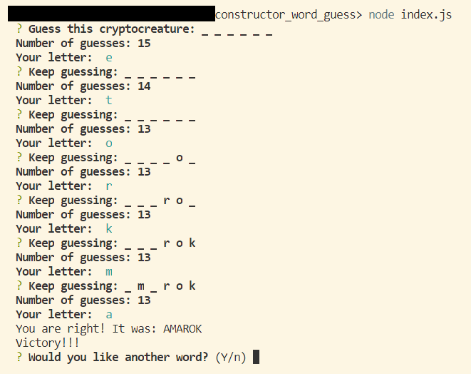
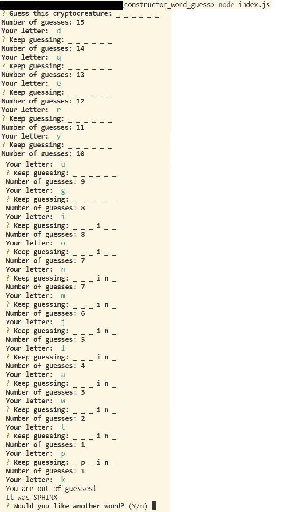

# constructor_word_guess
UW-Extension Boot Camp Homework Week 11
Purpose: Learn to work with Node.js, npm packages (particularly inquirer), constructors.

Description: Command line app, offers you to guess a name of cryptocreature letter by letter. 
If you wish to clone and run it, you will have to run 'npm install' to get fs and inquirer packages. Then run node index.js in your terminal. Follow the prompt. 
Once you guessed (or not) you have an option to guess another one or quit.

*If you win

*If you lose

See it alive:

https://drive.google.com/file/d/1PRMyovISIki_46axkG3kDv-Af_yPJto7/view